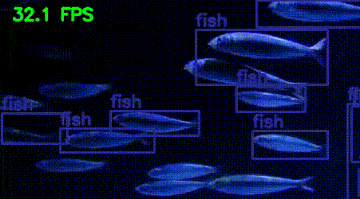
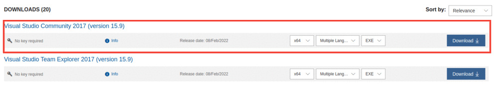

# A Simple Pipeline to Train PyTorch FasterRCNN Model


Train PyTorch FasterRCNN models easily on any custom dataset. Choose between official PyTorch models trained on COCO dataset, or choose any backbone from Torchvision classification models, or even write your own custom backbones. 

***You can run a Faster RCNN model with Mini Darknet backbone and Mini Detection Head at more than 150 FPS on an RTX 3080***.



## Get Started

​																								[](https://colab.research.google.com/drive/1oFxPpBeE8SzSQq7BTUv28IIqQeiHHLdj?usp=sharing) [](https://www.kaggle.com/code/sovitrath/custom-faster-rcnn-training-kaggle/notebook)

* [Find blog posts/tutorials on DebuggerCafe](#Tutorials)

## [Check Updates Here](https://github.com/sovit-123/fasterrcnn-pytorch-training-pipeline/blob/main/docs/updates.md)

## Custom Model Naming Conventions

***For this repository:***

* **Small head refers to 512 representation size in the Faster RCNN head and predictor.**
* **Tiny head refers to 256 representation size in the Faster RCNN head and predictor.**
* **Nano head refers to 128 representation size in the Faster RCNN head and predictor.**

## [Check All Available Model Flags](#A-List-of-All-Model-Flags-to-Use-With-the-Training-Script)

## Go To

* [Setup on Ubuntu](#Setup-for-Ubuntu)
* [Setup on Windows](#Setup-on-Windows)
* [Train on Custom Dataset](#Train-on-Custom-Dataset)
* [Inference](#Inference)
* [Evaluation](#Evaluation)
* [Available Models](#A-List-of-All-Model-Flags-to-Use-With-the-Training-Script)
* [Tutorials](#Tutorials)

## Setup on Ubuntu

1. Clone the repository.

   ```
   git clone https://github.com/sovit-123/fastercnn-pytorch-training-pipeline.git
   ```

2. Install requirements.

   1. **Method 1**: If you have CUDA and cuDNN set up already, do this in your environment of choice.

      ```
      pip install -r requirements.txt
      ```

   2. **Method 2**: If you want to install PyTorch with CUDA Toolkit in your environment of choice.

      ```
      conda install pytorch torchvision torchaudio cudatoolkit=10.2 -c pytorch
      ```

      OR

      ```
      conda install pytorch torchvision torchaudio cudatoolkit=11.3 -c pytorch
      ```

      OR install the version with CUDA support as per your choice from **[here](https://pytorch.org/get-started/locally/)**.

      Then install the remaining **[requirements](https://github.com/sovit-123/fasterrcnn-pytorch-training-pipeline/blob/main/requirements.txt)**.

## Setup on Windows

1. **First you need to install Microsoft Visual Studio from [here](https://my.visualstudio.com/Downloads?q=Visual%20Studio%202017)**. Sing In/Sing Up by clicking on **[this link](https://my.visualstudio.com/Downloads?q=Visual%20Studio%202017)** and download the **Visual Studio Community 2017** edition.

   

   Install with all the default chosen settings. It should be around 6 GB. Mainly, we need the C++ Build Tools.

2. Then install the proper **`pycocotools`** for Windows.

   ```
   pip install git+https://github.com/gautamchitnis/cocoapi.git@cocodataset-master#subdirectory=PythonAPI
   ```

3. Clone the repository.

   ```
   git clone https://github.com/sovit-123/fastercnn-pytorch-training-pipeline.git
   ```

4. Install PyTorch with CUDA support.

   ```
   conda install pytorch torchvision torchaudio cudatoolkit=10.2 -c pytorch
   ```

   OR

   ```
   conda install pytorch torchvision torchaudio cudatoolkit=11.3 -c pytorch
   ```

   OR install the version with CUDA support as per your choice from **[here](https://pytorch.org/get-started/locally/)**.

   Then install the remaining **[requirements](https://github.com/sovit-123/pytorch-efficientdet-api/blob/main/requirements.txt)** except for `pycocotools`.

## Train on Custom Dataset

Taking an exmaple of the [smoke dataset](https://www.kaggle.com/didiruh/smoke-pascal-voc) from Kaggle. Let's say that the dataset is in the `data/smoke_pascal_voc` directory in the following format. And the `smoke.yaml` is in the `data_configs` directory. Assuming, we store the smoke data in the `data` directory

```
├── data
│   ├── smoke_pascal_voc
│   │   ├── archive
│   │   │   ├── train
│   │   │   └── valid
│   └── README.md
├── data_configs
│   └── smoke.yaml
├── models
│   ├── create_fasterrcnn_model.py
│   ...
│   └── __init__.py
├── outputs
│   ├── inference
│   └── training
│       ...
├── readme_images
│   ...
├── torch_utils
│   ├── coco_eval.py
│   ...
├── utils
│   ├── annotations.py
│   ...
├── datasets.py
├── inference.py
├── inference_video.py
├── __init__.py
├── README.md
├── requirements.txt
└── train.py
```

The content of the `smoke.yaml` should be the following:

```yaml
# Images and labels direcotry should be relative to train.py
TRAIN_DIR_IMAGES: ../../xml_od_data/smoke_pascal_voc/archive/train/images
TRAIN_DIR_LABELS: ../../xml_od_data/smoke_pascal_voc/archive/train/annotations
# VALID_DIR should be relative to train.py
VALID_DIR_IMAGES: ../../xml_od_data/smoke_pascal_voc/archive/valid/images
VALID_DIR_LABELS: ../../xml_od_data/smoke_pascal_voc/archive/valid/annotations

# Class names.
CLASSES: [
    '__background__',
    'smoke'
]

# Number of classes (object classes + 1 for background class in Faster RCNN).
NC: 2

# Whether to save the predictions of the validation set while training.
SAVE_VALID_PREDICTION_IMAGES: True
```

***Note that*** *the data and annotations can be in the same directory as well. In that case, the TRAIN_DIR_IMAGES and TRAIN_DIR_LABELS will save the same path. Similarly for VALID images and labels. The `datasets.py` will take care of that*.

Next, to start the training, you can use the following command.

**Command format:**

```
python train.py --data <path to the data config YAML file> --epochs 100 --model <model name (defaults to fasterrcnn_resnet50)> --name <folder name inside output/training/> --batch 16
```

**In this case, the exact command would be:**

```
python train.py --data data_configs/smoke.yaml --epochs 100 --model fasterrcnn_resnet50_fpn --name smoke_training --batch 16
```

**The terimal output should be similar to the following:**

```
Number of training samples: 665
Number of validation samples: 72

3,191,405 total parameters.
3,191,405 training parameters.
Epoch     0: adjusting learning rate of group 0 to 1.0000e-03.
Epoch: [0]  [ 0/84]  eta: 0:02:17  lr: 0.000013  loss: 1.6518 (1.6518)  time: 1.6422  data: 0.2176  max mem: 1525
Epoch: [0]  [83/84]  eta: 0:00:00  lr: 0.001000  loss: 1.6540 (1.8020)  time: 0.0769  data: 0.0077  max mem: 1548
Epoch: [0] Total time: 0:00:08 (0.0984 s / it)
creating index...
index created!
Test:  [0/9]  eta: 0:00:02  model_time: 0.0928 (0.0928)  evaluator_time: 0.0245 (0.0245)  time: 0.2972  data: 0.1534  max mem: 1548
Test:  [8/9]  eta: 0:00:00  model_time: 0.0318 (0.0933)  evaluator_time: 0.0237 (0.0238)  time: 0.1652  data: 0.0239  max mem: 1548
Test: Total time: 0:00:01 (0.1691 s / it)
Averaged stats: model_time: 0.0318 (0.0933)  evaluator_time: 0.0237 (0.0238)
Accumulating evaluation results...
DONE (t=0.03s).
IoU metric: bbox
 Average Precision  (AP) @[ IoU=0.50:0.95 | area=   all | maxDets=100 ] = 0.001
 Average Precision  (AP) @[ IoU=0.50      | area=   all | maxDets=100 ] = 0.002
 Average Precision  (AP) @[ IoU=0.75      | area=   all | maxDets=100 ] = 0.000
 Average Precision  (AP) @[ IoU=0.50:0.95 | area= small | maxDets=100 ] = 0.000
 Average Precision  (AP) @[ IoU=0.50:0.95 | area=medium | maxDets=100 ] = 0.001
 Average Precision  (AP) @[ IoU=0.50:0.95 | area= large | maxDets=100 ] = 0.009
 Average Recall     (AR) @[ IoU=0.50:0.95 | area=   all | maxDets=  1 ] = 0.007
 Average Recall     (AR) @[ IoU=0.50:0.95 | area=   all | maxDets= 10 ] = 0.029
 Average Recall     (AR) @[ IoU=0.50:0.95 | area=   all | maxDets=100 ] = 0.074
 Average Recall     (AR) @[ IoU=0.50:0.95 | area= small | maxDets=100 ] = 0.028
 Average Recall     (AR) @[ IoU=0.50:0.95 | area=medium | maxDets=100 ] = 0.088
 Average Recall     (AR) @[ IoU=0.50:0.95 | area= large | maxDets=100 ] = 0.167
SAVING PLOTS COMPLETE...
...
Epoch: [4]  [ 0/84]  eta: 0:00:20  lr: 0.001000  loss: 0.9575 (0.9575)  time: 0.2461  data: 0.1662  max mem: 1548
Epoch: [4]  [83/84]  eta: 0:00:00  lr: 0.001000  loss: 1.1325 (1.1624)  time: 0.0762  data: 0.0078  max mem: 1548
Epoch: [4] Total time: 0:00:06 (0.0801 s / it)
creating index...
index created!
Test:  [0/9]  eta: 0:00:02  model_time: 0.0369 (0.0369)  evaluator_time: 0.0237 (0.0237)  time: 0.2494  data: 0.1581  max mem: 1548
Test:  [8/9]  eta: 0:00:00  model_time: 0.0323 (0.0330)  evaluator_time: 0.0226 (0.0227)  time: 0.1076  data: 0.0271  max mem: 1548
Test: Total time: 0:00:01 (0.1116 s / it)
Averaged stats: model_time: 0.0323 (0.0330)  evaluator_time: 0.0226 (0.0227)
Accumulating evaluation results...
DONE (t=0.03s).
IoU metric: bbox
 Average Precision  (AP) @[ IoU=0.50:0.95 | area=   all | maxDets=100 ] = 0.137
 Average Precision  (AP) @[ IoU=0.50      | area=   all | maxDets=100 ] = 0.313
 Average Precision  (AP) @[ IoU=0.75      | area=   all | maxDets=100 ] = 0.118
 Average Precision  (AP) @[ IoU=0.50:0.95 | area= small | maxDets=100 ] = 0.029
 Average Precision  (AP) @[ IoU=0.50:0.95 | area=medium | maxDets=100 ] = 0.175
 Average Precision  (AP) @[ IoU=0.50:0.95 | area= large | maxDets=100 ] = 0.428
 Average Recall     (AR) @[ IoU=0.50:0.95 | area=   all | maxDets=  1 ] = 0.204
 Average Recall     (AR) @[ IoU=0.50:0.95 | area=   all | maxDets= 10 ] = 0.306
 Average Recall     (AR) @[ IoU=0.50:0.95 | area=   all | maxDets=100 ] = 0.347
 Average Recall     (AR) @[ IoU=0.50:0.95 | area= small | maxDets=100 ] = 0.140
 Average Recall     (AR) @[ IoU=0.50:0.95 | area=medium | maxDets=100 ] = 0.424
 Average Recall     (AR) @[ IoU=0.50:0.95 | area= large | maxDets=100 ] = 0.683
SAVING PLOTS COMPLETE...
```

## Distributed Training

**Training on 2 GPUs**:

```
export CUDA_VISIBLE_DEVICES=0,1
python -m torch.distributed.launch --nproc_per_node=2 --use_env train.py --data data_configs/smoke.yaml --epochs 100 --model fasterrcnn_resnet50_fpn --name smoke_training --batch 16
```

## Inference

### Image Inference on COCO Pretrained Model

By default using **Faster RCNN ResNet50 FPN V2** model.

```
python inference.py
```

Use model of your choice with an image input.

```
python inference.py --model fasterrcnn_mobilenetv3_large_fpn --input example_test_data/image_1.jpg
```

### Image Inference in Custom Trained Model

In this case you only need to give the weights file path and input file path. The config file and the model name are optional. If not provided they will will be automatically inferred from the weights file.

```
python inference.py --input data/inference_data/image_1.jpg --weights outputs/training/smoke_training/last_model_state.pth
```

### Video Inference on COCO Pretrrained Model

```
python inference_video.py
```

### Video Inference in Custom Trained Model

```
python inference_video.py --input data/inference_data/video_1.mp4 --weights outputs/training/smoke_training/last_model_state.pth 
```

## Evaluation

Replace the required arguments according to your need.

```
python eval.py --model fasterrcnn_resnet50_fpn_v2 --weights outputs/training/trial/best_model.pth --data data_configs/aquarium.yaml --batch 4
```

You can use the following command to show a table for **class-wise Average Precision** (`--verbose` additionally needed).

```
python eval.py --model fasterrcnn_resnet50_fpn_v2 --weights outputs/training/trial/best_model.pth --data data_configs/aquarium.yaml --batch 4 --verbose
```

## A List of All Model Flags to Use With the Training Script

The following command expects the `coco` dataset to be present one directory inside the `input` folder in XML format. You can find the dataset [here on Kaggle](https://www.kaggle.com/datasets/sovitrath/coco-xml-format). 

```
# Usage 
python train.py --model fasterrcnn_resnet50_fpn_v2 --data data_configs/coco.yaml
```

**OR USE ANY ONE OF THE FOLLOWING**

```
[
    'fasterrcnn_convnext_small',
    'fasterrcnn_convnext_tiny',
    'fasterrcnn_custom_resnet', 
    'fasterrcnn_darknet',
    'fasterrcnn_efficientnet_b0',
    'fasterrcnn_efficientnet_b4',
    'fasterrcnn_mbv3_small_nano_head',
    'fasterrcnn_mbv3_large',
    'fasterrcnn_mini_darknet_nano_head',
    'fasterrcnn_mini_darknet',
    'fasterrcnn_mini_squeezenet1_1_small_head',
    'fasterrcnn_mini_squeezenet1_1_tiny_head',
    'fasterrcnn_mobilenetv3_large_320_fpn', # Torchvision COCO pretrained
    'fasterrcnn_mobilenetv3_large_fpn', # Torchvision COCO pretrained
    'fasterrcnn_nano',
    'fasterrcnn_resnet18',
    'fasterrcnn_resnet50_fpn_v2', # Torchvision COCO pretrained
    'fasterrcnn_resnet50_fpn',  # Torchvision COCO pretrained
    'fasterrcnn_resnet101',
    'fasterrcnn_resnet152',
    'fasterrcnn_squeezenet1_0',
    'fasterrcnn_squeezenet1_1_small_head',
    'fasterrcnn_squeezenet1_1',
    'fasterrcnn_vitdet',
    'fasterrcnn_vitdet_tiny',
    'fasterrcnn_mobilevit_xxs',
    'fasterrcnn_regnet_y_400mf'
]
```

## Tutorials

* [Wheat Detection using Faster RCNN and PyTorch](https://debuggercafe.com/wheat-detection-using-faster-rcnn-and-pytorch/)
* [Plant Disease Detection using the PlantDoc Dataset and PyTorch Faster RCNN](https://debuggercafe.com/plant-disease-detection-using-plantdoc/)
* [Small Scale Traffic Light Detection using PyTorch](https://debuggercafe.com/small-scale-traffic-light-detection/)
